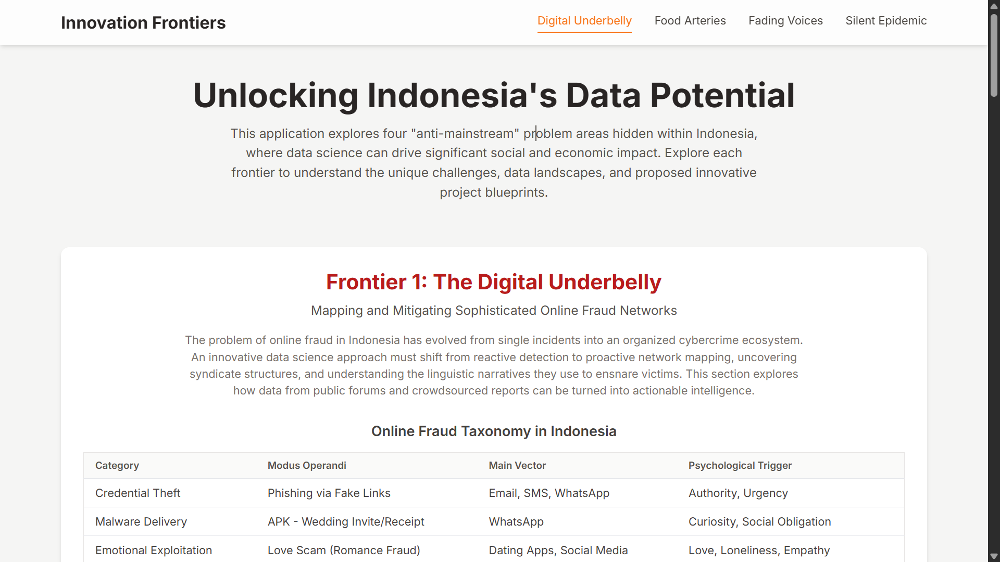

An interactive single-page application that reimagines how data scientists engage with real-world problems. This project transforms complex Indonesian societal issues into an engaging, data-driven exploration, highlighting how innovation, ethics, and impact intersect in local contexts.

**[➡️ View Live Demo Here](https://r1afif18.github.io/web-innovation-frontiers/)**

---

## 🎯 The Core Idea: Beyond Toy Datasets

Standard data science portfolios are often filled with projects based on clean, well-documented "toy datasets." While useful for learning, they fail to demonstrate the most critical skill in the industry: the ability to navigate and extract value from messy, unstructured, and culturally-rooted problems.

This project is an answer to that gap. It intentionally avoids pre-packaged problems and instead showcases a complete, end-to-end process: **from identifying "anti-mainstream" challenges in Indonesia to designing actionable, data-driven solutions.**

> **The goal is not just to present a dashboard, but to document a methodology for applying data science in high-impact, low-resource environments.**

This serves two purposes:
1.  **A Portfolio Piece:** To demonstrate a mastery of data storytelling, critical thinking, and advanced technical framing beyond simple model building.
2.  **A Strategic Toolkit:** To present a design pattern for tackling complex social challenges where data is scarce and context is everything.

---

## 🔬 From Chaos to Clarity: A Methodological Deep Dive

This project is built on a foundation of critical research. Each of the four frontiers was developed through a consistent process:
1.  **Problem Framing:** Identifying the core, underlying issue from unconventional sources (online forums, academic reports, NGO publications).
2.  **Data Provenance & Critique:** Pinpointing potential data trails, however faint, and critically assessing their inherent biases and limitations.
3.  **Solution Blueprinting:** Designing a concrete data science project that addresses the problem, acknowledging the data's flaws.

Here’s a breakdown for each frontier:

---

### Frontier 1: 🌐 The Digital Underbelly (Online Fraud)

> **The Challenge:** Online fraud in Indonesia is not a series of isolated incidents, but an organized ecosystem. How can we move from reactive blacklisting to proactive network disruption?

-   **Data Sourcing & Critical Assessment:**
    -   **Sources:** Crowdsourced reports from platforms like **[Kredibel.co.id](https://www.kredibel.com/search)**, public discussions on **Kaskus** and **Reddit**, and academic analysis like the **["Monograf Penipuan Digital"](https://cfds.fisipol.ugm.ac.id/wp-content/uploads/sites/1423/2022/08/PDF-Monograf-Penipuan-Digital-di-Indonesia-Modus-Medium-dan-Rekomendasi.pdf)** from UGM.
    -   **Critique:** The data is plagued by **severe reporting bias** (only captures digitally literate victims) and has **unverified veracity**. It must be treated as a source of "potential signals," not ground truth.

-   **Proposed Blueprint:**
    1.  **Social Network Analysis (SNA):** Ingest reports to build a graph where nodes are bank accounts/phone numbers and edges link entities appearing in the same report.
    2.  **Community Detection:** Apply algorithms like Louvain Modularity to automatically identify clusters of accounts likely controlled by a single syndicate.
    3.  **Linguistic Fingerprinting:** Use NLP to model the narrative structure of scam messages, creating a system that can detect new scam variants based on their linguistic style, not just keywords.

---

### Frontier 2: 🌾 The Food Arteries (Agriculture)

> **The Challenge:** The agricultural supply chain is crippled by a "first-mile data void"—a lack of reliable data at the farmer level, leading to massive inefficiencies.

-   **Data Sourcing & Critical Assessment:**
    -   **Sources:** A fusion of public datasets: **[ESA/USGS satellite imagery](https://dataspace.copernicus.eu/)** for vegetation health, **[BMKG](https://dataonline.bmkg.go.id/)** for weather data, and **[OpenStreetMap](https://www.openstreetmap.org/)** for road networks.
    -   **Critique:** Public satellite data has **coarse resolution** (10-30m), making it difficult to analyze smallholder farms. Weather and road data for remote areas are often **interpolated and outdated**, creating a model-reality gap.

-   **Proposed Blueprint:**
    1.  **Predictive Yield Modeling:** Use satellite and weather data to build a machine learning model that forecasts crop yields at a hyper-local level.
    2.  **Logistics Optimization:** Create a model that recommends optimal harvest times and calculates the most efficient collection routes based on predicted yields, market prices, and road conditions.

---

### Frontier 3: 🗣️ The Fading Voices (Languages)

> **The Challenge:** With over 700 languages, Indonesia faces a linguistic extinction crisis. How can we quantify the "digital health" of these languages to guide revitalization efforts at scale?

-   **Data Sourcing & Critical Assessment:**
    -   **Sources:** Academic corpora like **[NusaX](https://github.com/IndoNLP/nusa-catalogue/tree/main/datasets/nusax)**, government references from **[Peta Bahasa Kemdikbud](https://petabahasa.kemdikbud.go.id/)**, and large-scale web scraping from social media.
    -   **Critique:** Social media data suffers from a **severe demographic skew**, over-representing young, urban speakers and failing to capture the language of elders. It is a proxy for *digital* vitality, not overall language health.

-   **Proposed Blueprint:**
    1.  **Digital Vitality Index (DVI):** Develop a composite index for each language based on metrics like its presence on the web, usage on social media, and availability of NLP resources (e.g., keyboards, spell checkers).
    2.  **Geospatial Analysis:** Use geotagged social media data to map the real-time "digital boundaries" of language use, identifying areas where regional languages are receding.

---

### Frontier 4: ❤️‍🩹 The Silent Epidemic (Mental Health)

> **The Challenge:** Deep-seated stigma prevents open discussion about mental health. How can we ethically use anonymous online discourse to map the landscape of public concern and access barriers?

-   **Data Sourcing & Critical Assessment:**
    -   **Sources:** Anonymous, public discussions from communities like **[Reddit's r/indonesia](https://www.reddit.com/r/indonesia/)** and relevant **Quora** threads.
    -   **Critique:** The data is subject to **extreme self-selection bias**. It is not representative of the general population and must be treated as a signal of *online discourse*, not a direct measurement of public health. This frontier carries the highest ethical burden.

-   **Proposed Blueprint:**
    1.  **Topic Modeling:** Use advanced NLP models (e.g., BERTopic) to identify and track the primary themes of mental health conversations (e.g., work anxiety, family pressure, therapy costs).
    2.  **Stigma Quantification:** Develop a lexicon of stigmatizing terms and use it to build a model that measures the prevalence of stigmatizing language across different topics and regions.

---

## ✨ Key Features of the Dashboard

-   **Interactive Experience:** A smooth-scrolling single-page application for seamless exploration.
-   **Dynamic Visualizations:** Utilizes **Chart.js** to render responsive and interactive bubble charts, bar charts, and comparative index charts.
-   **Content Filtering:** Users can filter data within visualizations (e.g., by region) and switch between project blueprints using a clean tabbed interface.
-   **Decision Framework:** A summary table compares each frontier across key metrics like social impact, data accessibility, and ethical risk.
-   **Fully Responsive:** A mobile-first design built with Tailwind CSS ensures a seamless experience on any device.

## 🛠️ Tech Stack

| Technology | Badge | Purpose |
| --- | --- | --- |
| **HTML5** |  | Markup and Core Structure |
| **Tailwind CSS** |  | Utility-First CSS Framework |
| **JavaScript** |  | Interactivity & DOM Manipulation |
| **Chart.js** |  | Interactive Canvas-based Charts |

## 👤 Creator

This project was conceived, designed, and developed by:

**Rafif Sudanta**
- **Email:** [rafifsudanta1@gmail.com](mailto:rafifsudanta1@gmail.com)
- **LinkedIn:** [linkedin.com/in/rafif-sudanta](https://www.linkedin.com/in/rafif-sudanta/)
- **GitHub:** [@r1afif18](https://github.com/r1afif18)

## 📄 License

This project is open-source and released under the **MIT License**.

---

## 📚 Appendix: Key Research & Data Sources

This section lists the key public sources that informed the analysis and blueprints for each frontier. A full audit trail is crucial for scientific integrity.

### 1. The Digital Underbelly (Online Fraud)
-   **[Penipuan Digital di Indonesia: Modus, Medium, dan Rekomendasi](https://cfds.fisipol.ugm.ac.id/wp-content/uploads/sites/1423/2022/08/PDF-Monograf-Penipuan-Digital-di-Indonesia-Modus-Medium-dan-Rekomendasi.pdf)** - A foundational monograph by CFDS UGM that provides a structured overview of the scam landscape.
-   **[Kredibel.co.id](https://www.kredibel.com/search)** - A primary example of a crowdsourced platform for reporting scammer bank accounts, demonstrating the feasibility of data collection.
-   **[Digital Forensic Analysis Of APK Files In Phishing Scams](https://www.researchgate.net/publication/372704176_Digital_Forensic_Analysis_Of_APK_Files_In_Phishing_Scams_On_Whatsapp_Using_The_NIST_Method)** - A research paper that provides technical depth on the APK phishing modus operandi.
-   **[Contoh Diskusi Publik (Reddit)](https://www.reddit.com/r/indonesia/comments/16jb7z9/dugaan_modus_penipuan_baru/)** - An example of unstructured, real-world victim reports that serve as raw data for NLP analysis.

### 2. The Food Arteries (Agriculture)
-   **[Tantangan dan Peluang Rantai Pasokan Pertanian (Mertani)](https://mertani.co.id/post/tantangan-dan-peluang-yang-harus-dihadapi-di-sistem-rantai-pasokan-dalam-industri-pertanian)** - An industry article outlining the practical challenges in the Indonesian agricultural supply chain.
-   **[Copernicus Open Access Hub (Sentinel-2 Data)](https://dataspace.copernicus.eu/)** - The official portal for accessing Sentinel-2 satellite imagery, a key input for geospatial analysis.
-   **[BMKG Data Online](https://dataonline.bmkg.go.id/)** - The official government source for meteorological data in Indonesia.
-   **[Agri-Food Supply Chain Systematic Literature Review](https://jepa.ub.ac.id/index.php/jepa/article/view/722)** - An example of academic literature used to frame the supply chain optimization problem.

### 3. The Fading Voices (Languages)
-   **[NusaX: Multilingual Parallel Sentiment Dataset for 10 Indonesian Local Languages (GitHub)](https://github.com/IndoNLP/nusa-catalogue/tree/main/datasets/nusax)** - A critical, high-quality dataset that proves the feasibility of building NLP models for low-resource languages in Indonesia.
-   **[Peta Bahasa Kemdikbud](https://petabahasa.kemdikbud.go.id/)** - The official government reference for the distribution of languages across the archipelago.
-   **[Digital Language Death (PLOS One)](https://journals.plos.org/plosone/article?id=10.1371/journal.pone.0259055)** - A key academic paper that provides the conceptual framework for measuring digital language vitality.
-   **[NLP Challenges for Underrepresented Languages in Indonesia (ACL Anthology)](https://aclanthology.org/2022.acl-long.500/)** - A paper outlining the specific technical challenges (dialectal variation, lack of standard orthography) in this domain.

### 4. The Silent Epidemic (Mental Health)
-   **[Berdiskusi Tentang Kondisi Seputar Kesehatan Mental di Indonesia (Whiteboard Journal)](https://www.whiteboardjournal.com/ideas/perspectives/berdiskusi-tentang-kondisi-seputar-kesehatan-mental-di-indonesia/)** - An article providing qualitative context on the nature of mental health discourse in the country.
-   **[Pengetahuan dan Keterbukaan Masyarakat Terhadap Gangguan Kesehatan Mental (ResearchGate)](https://www.researchgate.net/publication/345248232_KESEHATAN_MENTAL_MASYARAKAT_INDONESIA_PENGETAHUAN_DAN_KETERBUKAAN_MASYARAKAT_TERHADAP_GANGGUAN_KESEHATAN_MENTAL)** - A research paper that offers insight into public knowledge and stigma levels, providing a baseline for analysis.
-   **[Contoh Diskusi Publik (Quora)](https://id.quora.com/Masalah-sosial-apa-yang-berat-tapi-jarang-dikritisi)** - An example of a forum thread where sensitive topics are discussed, representing a primary data source for discourse analysis.

